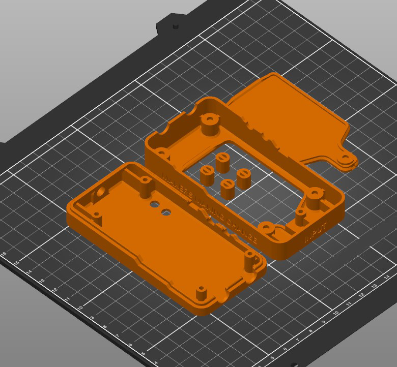

# 3D Print Files
All of these components are designed to be printed using a fused filament fabrication (FFF) 3D printer with a 0.4 mm nozzle. Filament color is not critical for function, so it should be left to the end-user's preference or muted tones like black or grey. For material, PLA should be sufficient. If

## Enclosure
| File                       	| Resolution 	| Infill 	| Support 	| Perimeters 	| Qty 	|
|----------------------------	|------------	|--------	|---------	|------------	|-----	|
| SPA_Encl_Battery_Cover.stl 	| 0.2 mm     	| 20%    	| No      	| 2          	| 1   	|
| SPA_Encl_Bottom.stl        	| 0.2 mm     	| 20%    	| No      	| 2          	| 1   	|
| SPA_Encl_LED_Spacer.stl    	| 0.2 mm     	| 20%    	| No      	| 2          	| 4   	|
| SPA_Encl_Top.stl           	| 0.2 mm     	| 20%    	| No      	| 2          	| 1   	|

## Mouthpiece Mount
| File                       	| Resolution 	| Infill 	| Support 	| Perimeters 	| Qty 	|
|----------------------------	|------------	|--------	|---------	|------------	|-----	|
| SPA_MP_Base.stl            	| 0.2 mm     	| 20%    	| Yes      	| 2          	| 1   	|
| SPA_MP_Cap.stl             	| 0.2 mm     	| 20%    	| No      	| 2          	| 1   	|
| SPA_MP_Lower_Swivel.stl    	| 0.2 mm     	| 20%    	| Yes      	| 2          	| 1   	|
| SPA_MP_M3WingNut.stl       	| 0.2 mm     	| 20%    	| No      	| 2          	| 1   	|
| SPA_MP_Top_Swivel.stl      	| 0.2 mm     	| 20%    	| Yes      	| 2          	| 1   	|
